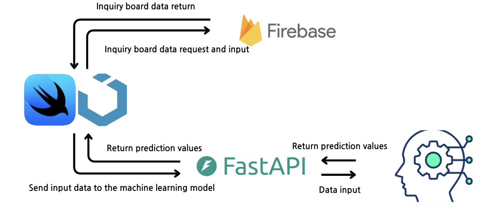
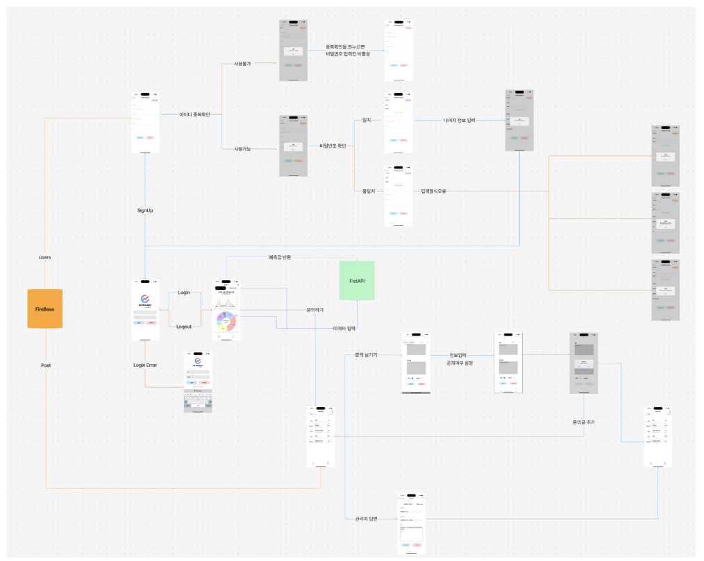
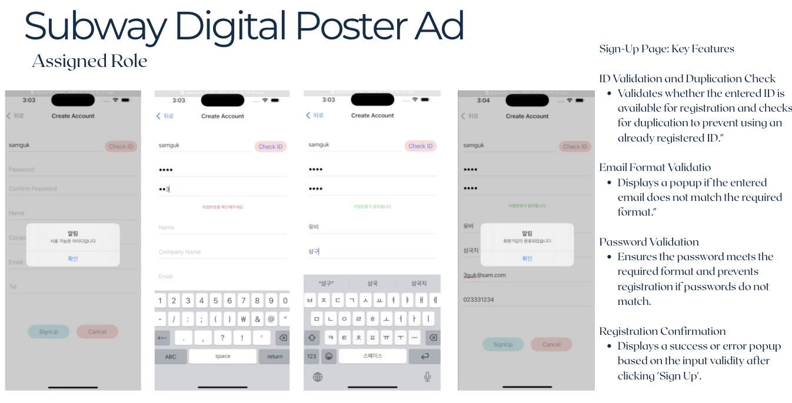

# Subway Digital Poster Ad

---

## Table of Contents

- [Overview](#overview)
- [Demo Video](#demo-video)
- [Features](#features)
- [My Contributions](#my-contributions)
- [Tech Stack](#tech-stack)
- [System Architecture](#system-architecture)
- [Screen Flow Diagram](#screen-flow-diagram)
- [Screenshots](#screenshots)
- [Data Analysis](#data-analysis)
- [How to Run](#how-to-run)
- [Contact](#contact)

---

## Overview

Subway Digital Poster Ad is an iOS application developed using SwiftUI to optimize subway advertisement targeting.  
The project analyzes passenger data by location, time slot, and demographics, and includes a user-friendly registration system for enhanced user experience.

- **Team Size:** 5 members  
- **Project Duration:** January 10, 2025 – February 5, 2025

---

## Demo Video

- [Demo Video](https://youtu.be/1IkXuh4D-f0)

---

## Features

- **Registration System**:  
  - ID duplication check and email format validation  
  - Password validation logic with success/error popups
- **Ad Targeting**:  
  - Analyzed subway station data to optimize ad targeting  
  - Developed predictive models for effective ad placement

---

## My Contributions

- Designed a user-friendly registration page with input validation
- Implemented ID duplication check and email format validation
- Added password validation logic with success/error popups
- Analyzed subway station data to optimize advertisement targeting  
  > *Note: No significant patterns were found in the data, so the analysis was not reflected in the final app, but the full analysis process is included for reference.*

---

## Tech Stack

- **Frontend**: SwiftUI (iOS app development)
- **Backend**: FastAPI (API design and server-side integration)
- **Data Analysis**: Python (data preprocessing and machine learning model development)
- **Database**: Firebase

---

## System Architecture

---

## Screen Flow Diagram

---

## Screenshots

### Main Screenshots (Features I Developed)

---

## Data Analysis

The full data analysis process (PDF) is available here:  
- [Data Analysis Report (PDF)](image/data_analysis.pdf)

> The analysis included data preprocessing and exploration, but no distinct patterns were found for ad targeting.

---

## How to Run

### iOS App

1. Clone the repository  
   `git clone [your-repository-url]`
2. Open the project in Xcode
3. Install dependencies using CocoaPods (if needed)
4. Run the app on a simulator or a physical device

### Backend (FastAPI)

1. Go to the `Python_Server` directory:
